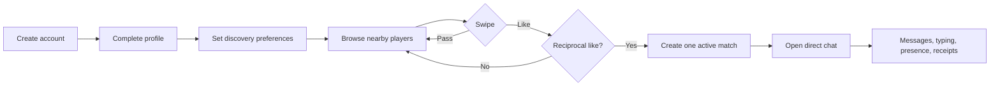
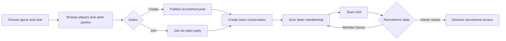
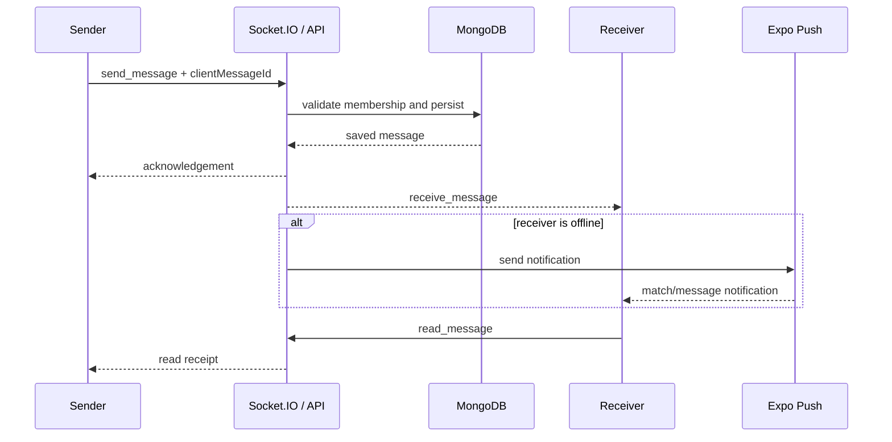
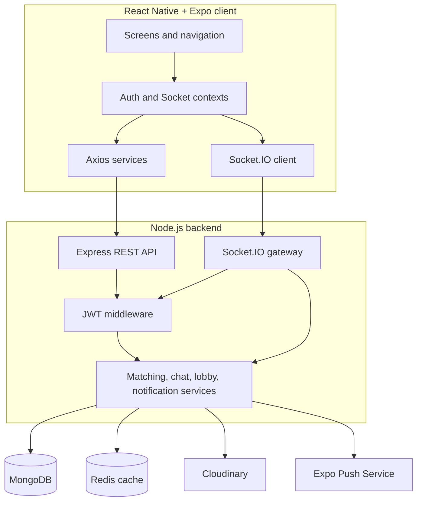

# Tindah

<p align="center">
  
</p>

<p align="center">
  A cross-platform social gaming app for discovering compatible players,<br />
  forming teams, matching, and chatting in real time.
</p>

Tindah combines profile-based discovery with game-specific recruitment. Users can
swipe on nearby players, match after a mutual like, create or join a gaming party,
and continue the conversation in a direct or team chat. The client runs on web,
Android, and iOS through React Native and Expo.

## Table of contents

- [Features](#features)
- [Product flows](#product-flows)
- [Architecture](#architecture)
- [Technology](#technology)
- [Project structure](#project-structure)
- [Getting started](#getting-started)
- [Configuration](#configuration)
- [Testing](#testing)
- [API overview](#api-overview)
- [Realtime events](#realtime-events)
- [Troubleshooting](#troubleshooting)
- [Contributing](#contributing)

## Features

- JWT-based registration, login, session restoration, and profile management
- Location-, age-, gender-, and preference-aware player discovery
- Idempotent likes and passes with duplicate-match protection
- Game and rank filtering for Valorant, PUBG Mobile, Free Fire, TFT, and Liên Quân
- Recruitment posts with create, join, leave, and close workflows
- Direct and team conversations backed by active matches
- Realtime messages, typing indicators, presence, unread state, and read receipts
- Offline Expo push notifications for matches and messages
- Resilient message retries after a client reconnects
- Cloudinary image storage in production and local storage in development
- Redis-accelerated swipe exclusions with a MongoDB fallback
- Responsive layouts for mobile and desktop web

## Product flows

### Discovery and matching



Every swipe is persisted. Redis caches excluded profile IDs for fast discovery;
if Redis is unavailable, the backend derives exclusions from MongoDB. A reciprocal
like creates one match through idempotent service logic and unique indexes.

### Gaming party recruitment



Recruitment ranks are normalized into lobby groups. Creating a post provisions a
named team conversation; join, leave, and close actions keep its membership in sync.

### Realtime message delivery



`clientMessageId` makes retries idempotent. The frontend retains unacknowledged
messages and sends them again after reconnecting.

## Architecture



The Express application exposes REST endpoints under `/api`, while the HTTP server
hosts Socket.IO on the same port. MongoDB is the source of truth. Redis, Cloudinary,
and Expo Push are supporting integrations and can be omitted for most local work.

## Technology

| Layer | Main technologies |
| --- | --- |
| Client | React 19, React Native, Expo, React Navigation, Axios, AsyncStorage |
| Realtime | Socket.IO and Socket.IO Client |
| API | Node.js, Express, JWT, Multer |
| Data | MongoDB, Mongoose, Redis |
| Media and notifications | Cloudinary, Expo Push Service |
| Quality | Jest, Supertest, MongoDB Memory Server, k6 |

## Project structure

```text
.
├── backend/
│   ├── src/
│   │   ├── config/          # MongoDB, Redis, and external integrations
│   │   ├── controllers/     # HTTP request handling
│   │   ├── middlewares/     # Authentication, validation, and content filtering
│   │   ├── models/          # Mongoose schemas
│   │   ├── routes/          # REST route definitions
│   │   ├── services/        # Domain and integration logic
│   │   ├── sockets/         # Realtime event handlers
│   │   ├── app.js           # Express application
│   │   └── server.js        # Database, Redis, Socket.IO, and HTTP bootstrap
│   └── tests/               # Unit, integration, route, and socket tests
├── frontend/
│   ├── assets/              # App and game artwork
│   ├── src/
│   │   ├── components/      # Shared UI components
│   │   ├── context/         # Authentication and realtime state
│   │   ├── navigation/      # Tabs, stacks, and notification routing
│   │   ├── screens/         # Product screens
│   │   └── services/        # REST, Socket.IO, upload, and push clients
│   └── App.js
├── docs/                    # Detailed architecture, API, Redis, and load-test notes
└── load-tests/              # k6 scenarios
```

## Getting started

### Prerequisites

- Node.js 20 or newer and npm
- MongoDB (local instance or Atlas cluster)
- Redis 7.x (optional for local development)
- Expo Go, an emulator, or a browser for the client
- k6 (only for load testing)

### 1. Clone and install

Install the backend and frontend independently; the root `package.json` is not the
application workspace.

```bash
git clone <repository-url>
cd Tindah

cd backend
npm install

cd ../frontend
npm install
```

### 2. Configure the backend

From the repository root:

```bash
# macOS / Linux
cp backend/.env.example backend/.env

# Windows PowerShell
Copy-Item backend/.env.example backend/.env
```

At minimum, set `MONGO_URI` and a strong `JWT_SECRET` in `backend/.env`.

```env
NODE_ENV=development
PORT=5000
MONGO_URI=mongodb://127.0.0.1:27017/tinderapp
JWT_SECRET=replace-with-a-long-random-secret
JWT_EXPIRES_IN=7d
CLIENT_ORIGIN=http://localhost:8081
PUBLIC_BASE_URL=http://localhost:5000
```

Start the API:

```bash
cd backend
npm run dev
```

Confirm that it is ready:

```bash
curl http://localhost:5000/health
```

Expected response:

```json
{
  "status": "ok",
  "service": "tinder-clone-api",
  "timestamp": "<ISO-8601 timestamp>"
}
```

Interactive Swagger documentation is available at
[`http://localhost:5000/api-docs`](http://localhost:5000/api-docs).

### 3. Start the client

In a second terminal:

```bash
cd frontend
npm start
```

Expo will offer web, Android, and iOS targets. They can also be started directly:

```bash
npm run web
npm run android
npm run ios
```

The default client API is `http://localhost:5000/api`. When using a physical phone,
create `frontend/.env` and replace the address with the development machine's LAN IP:

```env
EXPO_PUBLIC_API_URL=http://192.168.1.10:5000/api
```

The phone and development machine must be on the same network, and the backend port
must be allowed through the local firewall. Restart Expo after changing environment
variables.

## Configuration

### Backend environment variables

| Variable | Required | Default | Description |
| --- | :---: | --- | --- |
| `MONGO_URI` | Yes | — | MongoDB connection string |
| `JWT_SECRET` | Yes | Development fallback | Secret used to sign access tokens |
| `PORT` | No | `5000` | HTTP and Socket.IO port |
| `NODE_ENV` | No | — | Set to `production` for production behavior |
| `JWT_EXPIRES_IN` | No | `7d` | JWT lifetime |
| `CLIENT_ORIGIN` | No | `*` for Socket.IO | Allowed frontend origin |
| `REDIS_URL` | No | — | Redis connection URL for swipe exclusions |
| `PUBLIC_BASE_URL` | No | Request origin | Public URL used for local image links |
| `CLOUDINARY_CLOUD_NAME` | Production media | — | Cloudinary account name |
| `CLOUDINARY_API_KEY` | Production media | — | Cloudinary API key |
| `CLOUDINARY_API_SECRET` | Production media | — | Cloudinary API secret |
| `EXPO_ACCESS_TOKEN` | No | — | Access token for secured Expo push projects |

Do not commit `.env` files or real credentials. Redis is optional: discovery falls
back to MongoDB. In development, missing Cloudinary credentials cause image uploads
to be stored under `backend/public/uploads`.

### Frontend environment variables

| Variable | Required | Default | Description |
| --- | :---: | --- | --- |
| `EXPO_PUBLIC_API_URL` | No | `http://localhost:5000/api` | Base URL used by Axios; Socket.IO derives its origin from this value |

Push notifications also require a valid Expo/EAS `projectId` in
`frontend/app.json` and a supported physical device.

## Testing

### Automated tests

Run the backend Jest suite:

```bash
cd backend
npm test
```

The tests start an isolated MongoDB Memory Server and clear collections between test
cases. They do not require the development MongoDB database. The first run may need
to download a MongoDB binary.

Export the frontend web bundle as a production build check:

```bash
cd frontend
npx expo export --platform web
```

### Test coverage matrix

| Area | Representative test case | Expected result |
| --- | --- | --- |
| Authentication | Register, log in, and restore a user | JWT and sanitized user are returned; invalid input is rejected |
| Discovery | Query with age, gender, mutual-interest, and distance filters | Only eligible, nearby, unswiped profiles are returned |
| Matching | Two users like each other concurrently | Exactly one active match is created |
| Swipe cache | Redis is unavailable | Excluded users still come from MongoDB |
| Chat authorization | A non-member requests match messages | Request is denied |
| Messaging | Retry the same `clientMessageId` | One stored message is returned without duplication |
| Realtime | Send to a joined match room | Members receive the message; unrelated rooms do not |
| Read receipts | Receiver opens a conversation | Read state is emitted to participants |
| Recruitment | Create, join, leave, and close a party | Post and team-chat membership remain synchronized |
| Uploads | Upload an invalid type or a file over 5 MB | Request is rejected with `400` |
| Push tokens | Save and revoke a device token repeatedly | Operations remain idempotent and preserve audit metadata |

### Manual end-to-end smoke test

Use two test accounts on separate browsers or devices:

1. Register both accounts and complete their profiles with compatible preferences.
2. Give both users nearby coordinates and confirm they appear in Explore.
3. Like the second user from the first account; confirm that no match exists yet.
4. Like the first user from the second account; confirm that one match appears for both.
5. Send a message and verify realtime delivery, typing state, and unread count.
6. Open the conversation as the receiver and verify the read receipt.
7. Create a recruitment post, join it with the other account, and verify the shared chat.
8. Leave or close the recruitment and verify that membership updates on both clients.
9. Background one physical device, send a message, and verify the push notification.

### Load testing

The k6 scenario creates 100 temporary accounts and sends reciprocal likes with 100
virtual users for one minute. Run it only against an isolated development or staging
database:

```bash
# Terminal 1
cd backend
npm run dev

# Terminal 2, from the repository root
k6 run load-tests/swipes-load-test.js
```

The thresholds require no HTTP 500 responses, no swipe request errors, all response
checks to pass, and an average swipe response time of at most 200 ms. See
[`docs/LOAD_TESTING.md`](docs/LOAD_TESTING.md) for configuration, reporting, and safe
cleanup guidance.

## API overview

All JSON endpoints are rooted at `http://localhost:5000/api`. Protected routes use:

```http
Authorization: Bearer <JWT>
Content-Type: application/json
```

| Domain | Method | Endpoint | Purpose |
| --- | --- | --- | --- |
| Health | `GET` | `/health` | Service health check (outside `/api`) |
| Auth | `POST` | `/api/v1/auth/register` | Create an account |
| Auth | `POST` | `/api/v1/auth/login` | Start a session |
| Auth | `GET` | `/api/v1/auth/me` | Restore the current user |
| Profile | `PUT` | `/api/v1/users/profile` | Update profile and search preferences |
| Discovery | `GET` | `/api/v1/users/explore` | Find nearby compatible users |
| Discovery | `GET` | `/api/v1/swipes/discover` | Get swipe candidates |
| Swipe | `POST` | `/api/v1/swipes` | Like or pass a user |
| Match | `GET` | `/api/matches` | List direct and team matches |
| Match | `PATCH` | `/api/matches/:matchId/unmatch` | End a match |
| Chat | `GET` | `/api/v1/messages/:matchId` | Get paginated message history |
| Chat | `POST` | `/api/chats/:matchId/messages` | Send a message over REST |
| Upload | `POST` | `/api/v1/upload/image` | Upload JPG, PNG, or WEBP up to 5 MB |
| Push | `POST` / `DELETE` | `/api/v1/users/push-token` | Register or revoke an Expo token |
| Lobby | `GET` | `/api/v1/gamer-lobby/stats` | Get live gamer and party totals |
| Lobby | `GET` | `/api/v1/gamer-lobby/recruitments` | Browse open recruitment posts |
| Lobby | `POST` | `/api/v1/gamer-lobby/recruitments` | Create a party and team chat |
| Lobby | `POST` | `/api/v1/gamer-lobby/recruitments/:id/join` | Join a party |
| Lobby | `POST` | `/api/v1/gamer-lobby/recruitments/:id/leave` | Leave a party |
| Lobby | `PATCH` | `/api/v1/gamer-lobby/recruitments/:id/close` | Close a party |

Legacy unversioned auth, user, swipe, and upload paths remain mounted for
compatibility. Prefer the `/api/v1` paths for new integrations. For request and
response examples, see [`docs/API.md`](docs/API.md) or the local Swagger UI.

## Realtime events

Connect Socket.IO to the backend origin (without `/api`) and authenticate during the
handshake:

```js
import { io } from "socket.io-client";

const socket = io("http://localhost:5000", {
  transports: ["websocket"],
  auth: { token: "<JWT>" },
});
```

| Event | Direction | Purpose |
| --- | --- | --- |
| `presence:subscribe` | Client → server | Subscribe to presence for authorized matches |
| `presence:snapshot` | Server → client | Return current participant presence |
| `match:join` | Client → server | Validate membership and join a chat room |
| `send_message` | Client → server | Persist and broadcast a message |
| `receive_message` | Server → client | Deliver a saved message |
| `message:notification` | Server → client | Update conversation and unread state |
| `typing` | Bidirectional | Broadcast typing state inside a match |
| `read_message` | Bidirectional | Mark messages read and emit the receipt |
| `live_lobby:stats` | Server → client | Publish live online-user and open-party totals |

## Troubleshooting

### The API starts but database requests fail

Verify `MONGO_URI`, Atlas credentials, database-user permissions, and the Atlas IP
access list. The health endpoint only confirms that the HTTP process is running.

### Explore returns no users

Check both accounts' coordinates, age range, gender preference, mutual `interestedIn`
values, distance radius, and swipe history. Coordinates use MongoDB order:
`[longitude, latitude]`.

### A physical device cannot reach the API

Use the computer's LAN IP in `EXPO_PUBLIC_API_URL`, keep both devices on the same
network, allow port `5000` through the firewall, and restart Expo with a cleared cache:

```bash
cd frontend
npx expo start -c
```

### Redis is unavailable

Local development can continue without Redis. Leave `REDIS_URL` unset or start a
compatible Redis server; discovery uses MongoDB when the cache is offline.

### Image uploads do not use Cloudinary

Provide all three Cloudinary variables. Development deliberately falls back to local
storage when configuration is absent or Cloudinary fails; production does not.

### Push notifications do not appear

Use a valid Expo/EAS project ID and a supported physical device, allow notification
permissions, and confirm that the backend stored an active `ExponentPushToken[...]`.
Push delivery is skipped when the recipient is already online in the conversation.

## Documentation

- [`docs/ARCHITECTURE.md`](docs/ARCHITECTURE.md) — system organization
- [`docs/API.md`](docs/API.md) — additional API notes
- [`docs/REDIS.md`](docs/REDIS.md) — cache behavior and setup
- [`docs/LOAD_TESTING.md`](docs/LOAD_TESTING.md) — k6 scenario and pass criteria
- [`docs/ROADMAP.md`](docs/ROADMAP.md) — planned work
- [`CONTRIBUTING.md`](CONTRIBUTING.md) — contribution workflow
- [`SECURITY.md`](SECURITY.md) — vulnerability reporting

## Contributing

1. Create a focused branch from the current default branch.
2. Make the smallest coherent change and add or update tests.
3. Run `npm test` in `backend` and export the frontend when UI code changes.
4. Use a clear commit message (Conventional Commits are preferred).
5. Open a pull request describing the behavior, verification, and any limitations.

Please read [`CONTRIBUTING.md`](CONTRIBUTING.md) and
[`CODE_OF_CONDUCT.md`](CODE_OF_CONDUCT.md) before contributing.

## License

Tindah is available under the [MIT License](LICENSE).
