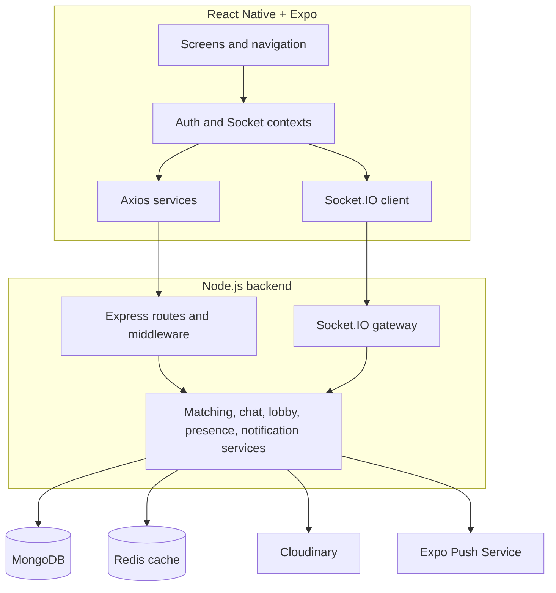

# System Architecture

Tindah is a React Native and Expo client backed by a Node.js API. REST and
Socket.IO share one HTTP server. MongoDB is the source of truth; Redis,
Cloudinary, and Expo Push are supporting integrations.



## Client

`frontend/App.js` initializes the application. Navigation switches between the
authentication flow and the main Explore, Gamer Lobby, Matches, and Profile tabs.
`AuthContext` restores JWT sessions, while `SocketContext` owns the authenticated
Socket.IO connection, conversation updates, presence, and reconnect behavior.

Screens call the service modules under `frontend/src/services` instead of issuing
requests directly. The Axios base URL comes from `EXPO_PUBLIC_API_URL`, defaulting
to `http://localhost:5000/api`. The Socket.IO origin is derived by removing `/api`.

## API process

`backend/src/server.js` loads `backend/.env`, connects to MongoDB, attempts the
optional Redis connection, registers Socket.IO, and starts the HTTP server.
`backend/src/app.js` configures CORS, JSON parsing, local upload serving, Swagger,
the `/health` endpoint, `/api` routes, and error handling.

HTTP requests generally flow through:

```text
route -> authentication/content middleware -> controller -> domain service -> model
```

JWTs are accepted as `Authorization: Bearer <token>`. Socket.IO authenticates the
same token from `handshake.auth.token` and joins each connection to a private
`user:<userId>` room.

## Domain modules

### Discovery and matching

Discovery filters candidates by location, age, gender, preferences, gaming data,
and previous swipes. MongoDB geospatial and gaming-profile indexes support these
queries. Redis caches each user's excluded target IDs for 24 hours; cache absence
or failure falls back to MongoDB.

Swipes are unique per `(swiper, target)`. A reciprocal like creates one active
match through idempotent matching logic and a unique participant key. Unmatching
retains the record with an `unmatched` status.

### Gamer lobby

Game/rank data is normalized into lobby groups. Recruitment creation provisions a
team conversation. Join, leave, and close operations update recruitment members,
match participants, and realtime membership notifications together.

### Messaging and presence

Messages belong to an authorized direct or team match. `clientMessageId` provides
idempotency for client retries. A saved message updates the match's last-message
summary and unread counters before it is broadcast. Typing state is ephemeral;
read state and message history are persisted. Presence is tracked per active
socket and broadcast only to authorized match subscribers.

### Media and notifications

Uploads accept JPG, PNG, and WEBP files up to 5 MB. Cloudinary is preferred when
configured; development can store files beneath `backend/public/uploads`.
Registered Expo push tokens receive offline match and message notifications.

## Persistence model

| Model | Responsibility |
| --- | --- |
| `User` | Identity, profile, preferences, location, gaming profiles, media, push tokens, presence |
| `Swipe` | One user's like, nope/pass, or superlike toward another user |
| `Match` | Direct or team conversation membership, status, unread counts, and last message |
| `Message` | Chat content, attachments, read state, and retry identifier |
| `GamerRecruitment` | Open/closed party post and current membership |
| `GamerTeamMatch` | Recruitment pairing metadata used by the gamer-lobby workflow |

## Reliability boundaries

- MongoDB is required for application data, although the HTTP process still starts
  and logs a warning if the initial connection fails.
- Redis is an optimization and never the source of truth.
- Socket and push delivery complement persisted messages; clients recover state
  through REST after reconnecting.
- Duplicate swipe, match, recruitment, and message operations are constrained by
  service logic and database indexes.
